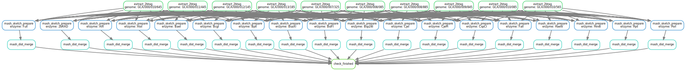

Compute mash distance quickly from large scale genome collections

# Workflow
<div align=center></div>

# Dry run
```
snakemake \
--snakefile Snakefile \
--configfile config.yaml \
--cores 40 --rerun-incomplete \
--keep-going --printshellcmds --reason \
--local-cores 8 --cores 32 --jobs 30 \
--profile /full/path/to/profiles/slurm \
/path/to/results/finished --dry-run
```

